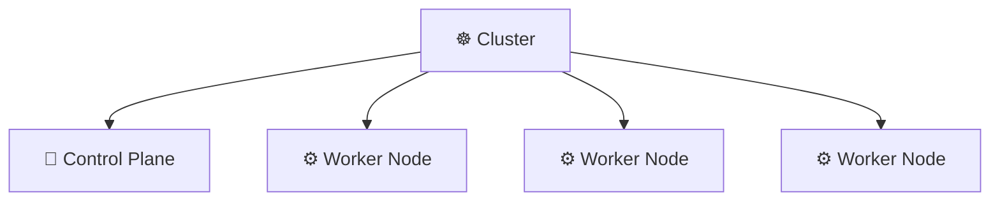
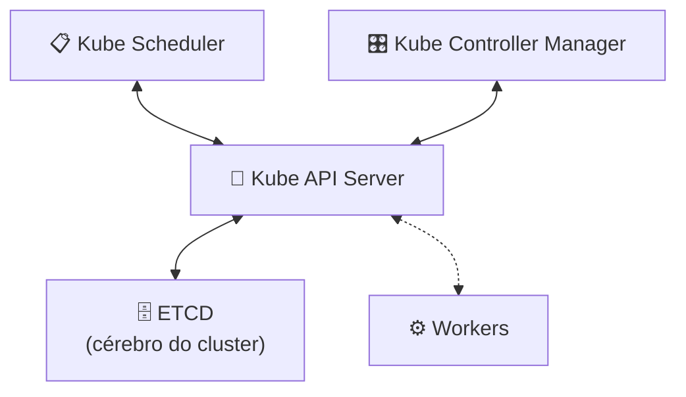
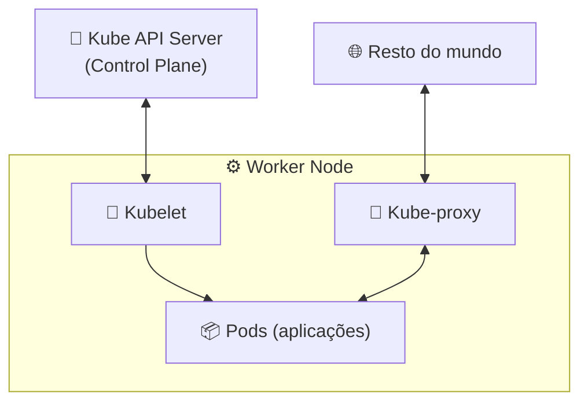

# 🏛️ Arquitetura do Kubernetes

> **Resumindo:** um **Cluster** é um conjunto de **Nodes** (computadores). Existem 2 tipos de Node: **Control Plane** e **Workers**.

## 🧠 Control Plane

> Responsável por **controlar o cluster**: garantir sua saúde (disponibilidade, capacidade) e armazenar o estado do cluster.

- Consegue executar aplicações que não são de gerenciamento do cluster — mas **não por padrão**, já que essa é atribuição dos Workers
- Conversa com os Workers o tempo inteiro

### Os 4 componentes do Control Plane

| Componente | Função | Conversa com |
|---|---|---|
| **ETCD** | Guarda todo o estado do cluster (o "cérebro"). Faz sentido ter redundância/réplicas. | Somente o Kube API Server |
| **Kube API Server** | Único que fala com o ETCD. Centraliza o status do cluster e dos serviços de gerenciamento, fazendo a ponte com o ETCD. | ETCD, Scheduler, Controller Manager, Workers |
| **Kube Scheduler** | Responsável pelo agendamento: faz o posicionamento de novos Pods e volumes nos nodes disponíveis. Sabe a capacidade de cada um. | Kube API Server |
| **Kube Controller Manager** | Controlador de Deployment, ReplicaSet, Pods — monitora a saúde. | Kube API Server |

> 💡 **Repare no padrão:** só o **API Server** fala com o **ETCD**. Todo o resto (Scheduler, Controller Manager, e também os Workers) fala com o **API Server** — nunca direto com o ETCD.

## ⚙️ Workers

É onde as aplicações estão rodando.

| Componente | Função | Conversa com |
|---|---|---|
| **Kubelet** | Agente do node. Cada node tem o seu. | Kube API Server (Control Plane) |
| **Kube-proxy** | Faz a comunicação dos Pods com o resto do mundo — o que for necessário pra expor um serviço ou fazer um container se conectar a outro. | Pods, rede do node |

> 🔗 **Conexão:** é o **Kubelet** quem aciona o **Container Runtime** (containerd, runc... ver **Container Engine & Runtime**) pra de fato criar e manter os containers rodando no node.

## 🔌 Portas de cada serviço

> Cada componente do cluster escuta em portas específicas — importante saber pra liberar firewall entre Control Plane e Workers, ou pra debugar um problema de conectividade.

| Onde | Componente | Porta | Protocolo | Para quê |
|---|---|---|---|---|
| Control Plane | Kube API Server | 6443 | TCP | Porta de entrada principal do cluster — todo o resto fala com o API Server por aqui |
| Control Plane | ETCD | 2379 | TCP | Comunicação com clientes (o próprio API Server) |
| Control Plane | ETCD | 2380 | TCP | Comunicação entre peers do ETCD (replicação do estado) |
| Control Plane | Kube Scheduler | 10259 | TCP | Endpoint seguro (métricas/healthz) |
| Control Plane | Kube Controller Manager | 10257 | TCP | Endpoint seguro (métricas/healthz) |
| Workers | Kubelet | 10250 | TCP | API do Kubelet — usada pelo Control Plane pra exec, logs e métricas do node |
| Workers | NodePort (Services) | 30000–32767 | TCP | Faixa reservada em **todo** Worker pra expor um Service do tipo `NodePort`, mesmo em nodes onde o Pod alvo não está rodando |
| Rede (CNI) | Weave Net | 6783–6784 | TCP/UDP | Comunicação entre nodes pra rotear o tráfego dos Pods — depende do plugin de CNI escolhido |

> ⚠️ **Nota:** as portas 10251 (Scheduler) e 10252 (Controller Manager) aparecem em materiais mais antigos — eram os endpoints **inseguros** (HTTP, sem autenticação), hoje desabilitados por padrão. As portas atuais e seguras são **10259** e **10257** (HTTPS).

> 👉 **Continua em Instalando o kubectl**: a ferramenta usada no dia a dia pra conversar com esse Cluster e seus componentes.
