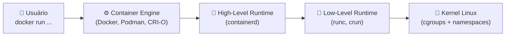
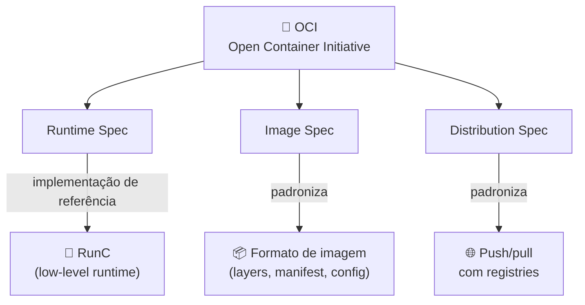

# ⚙️ Container Engine & Container Runtime

> **Resumindo:** o Container Engine é a ferramenta usada no dia a dia (`docker run`...); o Container Runtime é quem de fato faz a ponte com o Kernel pra executar o container.

## 🏗️ O que é Container Engine?

É a ferramenta usada no dia a dia (`docker run`, `podman run`...). Ela é responsável por:

- 🛠️ Criação do container
- ❤️ Health check
- 📁 Inserir pontos de montagem, volumes, diretórios
- 🌐 Configurar rede e storage

**Exemplos:** Docker, Podman, CRI-O

> ⚠️ **Ponto de atenção:** na maioria das vezes, o **Container Engine não conversa diretamente com o Kernel**. Quem faz essa ponte é o **Container Runtime**.

---

## 🚀 O que é o Container Runtime?

> **Função principal:** garantir que o container esteja de fato em execução.

**Opção mais usada no mercado:** containerd.

### Os tipos de Container Runtime

| Tipo | Quem executa | Fala direto com o Kernel? | Exemplos |
|---|---|---|---|
| **Low Level** | Diretamente pelo Kernel | ✅ Sim | RunC (padrão), CRun |
| **High Level** | Acionado pelo Container Engine | ❌ Não (delega ao low level) | ContainerD |
| **Sandbox / Virtualizado** | Camada extra de isolamento antes do Kernel | ❌ Não diretamente | gVisor (`runsc`), Kata Containers, Firecracker |

- **Sandbox** (ex: **gVisor**): intercepta as chamadas de sistema em um "kernel" rodando em espaço de usuário, sem expor o Kernel real ao container — mais isolamento, com custo de performance.
- **Virtualizado** (ex: **Kata Containers**, **Firecracker**): cada container roda dentro de uma microVM própria, com seu próprio kernel — isolamento no nível de VM, mantendo a experiência de container.

### A cadeia completa: da engine ao kernel



## 🔖 OCI (Open Container Initiative)

> **Resumindo:** a OCI é quem **padroniza** como uma imagem é empacotada e como um container é executado. É graças a ela que uma imagem feita com `docker build` roda sem drama em Podman, containerd, CRI-O, ou qualquer outro runtime "OCI-compliant".

Criada em **2015**, hospedada pela **Linux Foundation** — mesmo modelo de governança do próprio Kubernetes. Antes da OCI, cada engine tinha seu próprio formato de imagem e forma de executar containers; a padronização é o que permitiu o ecossistema inteiro (Docker, Podman, containerd, Kubernetes...) interoperar.

Ela mantém 3 especificações principais:

| Especificação | O que padroniza | Na prática |
|---|---|---|
| **Runtime Spec** | Como executar um container: configuração, bundle no disco, ciclo de vida | **RunC** é a implementação de referência dessa spec — por isso ele é o low-level runtime "padrão" |
| **Image Spec** | O formato da imagem: layers, manifest, config | Uma imagem do Docker Hub roda em qualquer runtime compatível com OCI |
| **Distribution Spec** | Como enviar/baixar imagens de um registry (push/pull) | Base da API usada por Docker Hub, GHCR, etc. |



> 🔗 **Conexão:** o RunC listado na tabela de "Low Level" acima não é só "o padrão" por acaso — ele **é literalmente a implementação de referência da OCI Runtime Spec**.

## 🧪 Exemplo prático

```bash
# roda um container isolado
docker run -it --rm alpine sh

# dentro do container: só enxerga os processos dele
ps aux

# no host: encontre o PID do processo do container
ps aux | grep alpine

# no host: veja os namespaces isolados desse processo
ls -l /proc/<PID>/ns/
```
