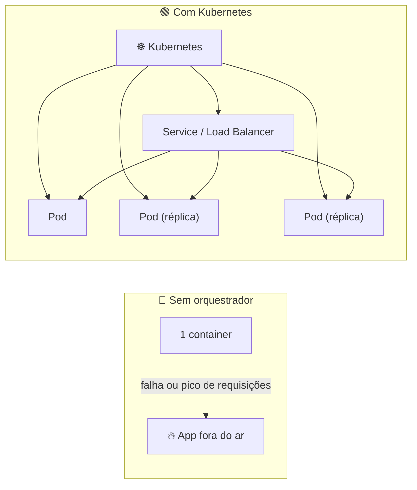
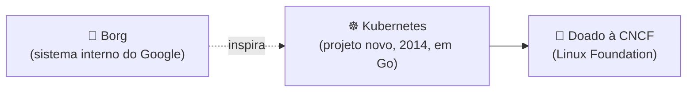

# ☸️ O que é o Kubernetes?

> **Resumindo:** um **orquestrador de containers** — organiza, controla e gerencia containers em produção.

## 😬 O problema que ele resolve

> Rodando a aplicação em um único container: se algo der errado — por exemplo, um pico de requisições — o serviço fica fora do ar, e isso gera estresse nos stakeholders.

Pra manipular os containers e "turbinar" a aplicação sob demanda, é aí que se torna necessário um orquestrador como o Kubernetes.

## ⚙️ O que ele faz

- Cria **réplicas** da aplicação quando a demanda exige
- Cria **Services**, **Load Balancers** e outros recursos pra entregar a aplicação "bonitinha"
- Organiza, controla e gerencia o ciclo de vida dos containers

✅ **Resultado:** alta disponibilidade, segurança e performance.

## 📜 Origem

- Criado pelo Google em **2014**
- Escrito em **Go**
- Inspirado nas lições aprendidas com o **Borg**, o sistema interno do Google
- Doado para a **CNCF** (Cloud Native Computing Foundation), hospedada pela Linux Foundation

> 👉 Continua em **Arquitetura do Kubernetes**: os componentes do Control Plane e dos Workers.
