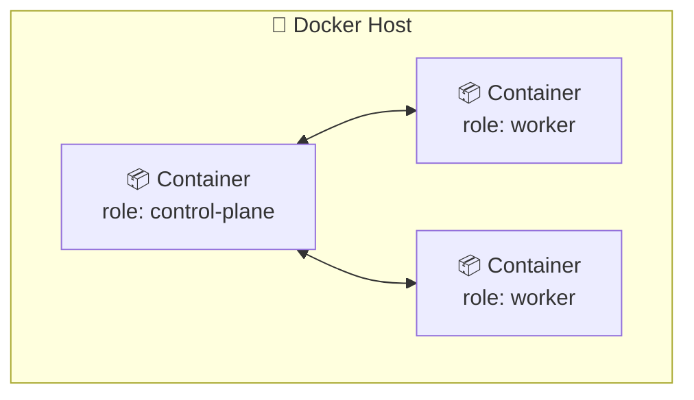

# 🐋 O que é o kind?

> **Resumindo:** kind (*Kubernetes IN Docker*) cria um cluster Kubernetes local usando containers Docker como se fossem os Nodes — sem precisar de VM nem de um provedor de nuvem.

## 🧩 O que é

- **kind = Kubernetes IN Docker.** Cada Node do cluster (Control Plane, Worker) é, na prática, um **container Docker** rodando os componentes do Kubernetes por dentro.
- Serve pra testar e estudar Kubernetes localmente, sem gastar recursos de uma VM completa nem depender de um cloud provider.
- Documentação oficial: https://kind.sigs.k8s.io/docs/user/quick-start/

## 🐋 Pré-requisito: Docker

kind precisa de um **Docker** (ou Podman) instalado e rodando, já que os Nodes do cluster são containers.

```bash
curl -fsSL https://get.docker.com | bash
```

- `-fsSL`: `-s` deixa o download silencioso, `-f` falha em erro HTTP em vez de baixar uma página de erro, e `-L` segue redirecionamentos de URL — necessário aqui, já que `get.docker.com` redireciona pro script real.

## 🚀 Comandos básicos

| Comando | O que faz |
|---|---|
| `kind create cluster` | Cria um cluster com **um único Node**, fazendo o papel de Control Plane e Worker ao mesmo tempo |
| `kubectl get nodes` | Lista os Nodes do cluster atual — mostra os Nodes criados pelo kind |
| `kind delete cluster` | Apaga o cluster (por padrão, o chamado `kind`) |

## 🏷️ Dando nome ao cluster: `--name`

Por padrão, o cluster criado se chama `kind`. Se quiser outro nome — ou manter **mais de um cluster** ao mesmo tempo — é só passar `--name`:

```bash
kind create cluster --name meu-cluster
kubectl get nodes --context kind-meu-cluster
kind delete cluster --name meu-cluster
```

- Sem `--name`, todo comando (`kind delete cluster`, `kubectl config use-context`, etc.) assume o cluster `kind`. Com vários clusters nomeados, é preciso informar `--name` (ou o context correspondente) pra saber com qual cluster o comando está falando.
- `kind get clusters` lista todos os clusters kind ativos na máquina, pelo nome.

## 📄 Criando um cluster com múltiplos Nodes: `--config`

Por padrão, `kind create cluster` sobe só 1 Node. Pra simular uma topologia real — Control Plane + Workers separados (ver **Arquitetura do Kubernetes**) — dá pra passar um **arquivo de configuração** via `--config`.

```yaml
# kind-cluster.yaml
kind: Cluster
apiVersion: kind.x-k8s.io/v1alpha4
nodes:
  - role: control-plane
  - role: worker
  - role: worker
```

```bash
kind create cluster --config kind-cluster.yaml
```

- Cada entrada em `nodes` vira um **container Docker separado**. No exemplo acima, o kind sobe 3 containers: 1 com o papel de `control-plane` e 2 com o papel de `worker`.
- `apiVersion: kind.x-k8s.io/v1alpha4` é o schema de configuração do **próprio kind** — não confundir com o `apiVersion` dos manifests do Kubernetes (tipo `apps/v1` de um Deployment, ver **O que é um Pod?**).



> 🔗 **Conexão:** essa topologia (1 Control Plane + N Workers) é a mesma estrutura descrita em **Arquitetura do Kubernetes** — o kind só materializa isso usando containers Docker no lugar de máquinas físicas ou VMs.

> 🔗 **Conexão:** depois do cluster criado, é o **kubectl** (ver **Instalando o kubectl**) quem conversa com ele — o kind já configura o kubeconfig automaticamente apontando pro cluster recém-criado.

> 👉 **Continua em Namespaces**: como o cluster recém-criado já organiza seus próprios componentes por dentro, usando namespaces como o `kube-system`.
