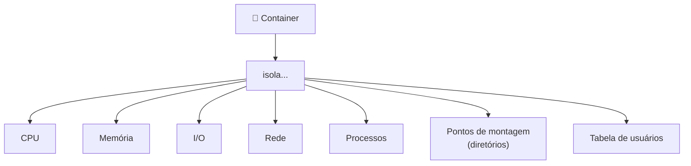
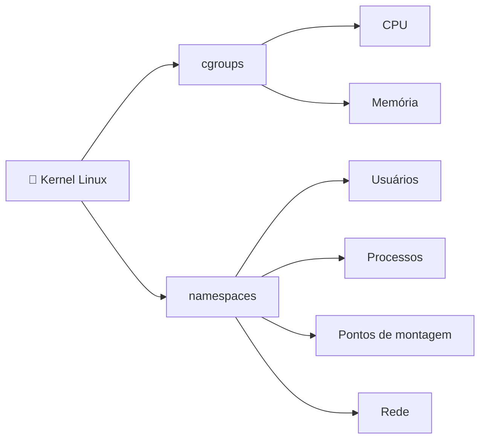

# 🐳 O que é um Container?

> **Resumindo:** um container é o **isolamento de recursos** de um processo, feito por dois módulos do Kernel Linux — **cgroups** e **namespaces**.

## 📦 Container = isolamento de recursos

"Recurso" aqui não é só CPU e memória — é tudo que um processo pode usar ou tocar.

## ⚙️ O que é um processo?

> Tudo o que está **em execução**: um aplicativo, um script qualquer, até o `ls` — enquanto ele está rodando, é um processo.

## 🧩 Os dois módulos do Kernel por trás do isolamento

| Módulo | Isola o quê | Onde vive |
|---|---|---|
| **cgroups** | CPU, Memória | Kernel |
| **namespaces** | Usuários, Processos, Pontos de montagem, Rede | Kernel |

✅ **Vantagem:** como o container só enxerga e usa o que foi isolado pra ele, **não consome recursos desnecessários** — diferente de uma máquina virtual, que carrega um SO inteiro.

> 👉 Continua em **Container Engine & Runtime**: quem de fato cria e executa o container usando esse isolamento.
