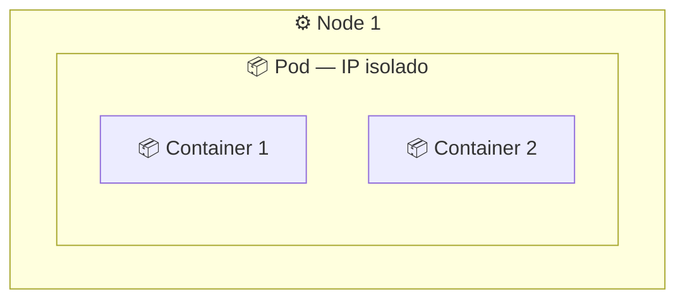
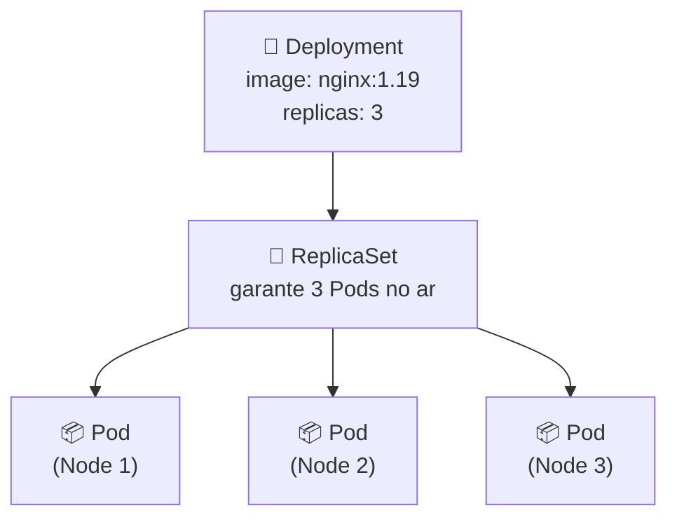

# 📦 O que é um Pod?

> **Resumindo:** um Pod é a menor unidade de execução do Kubernetes. Dentro dele vivem um ou mais containers, que compartilham o mesmo IP e a mesma rede.

## 🧱 Pod

- Não existe container "solto" no Kubernetes — ele sempre roda dentro de um Pod, que é a menor unidade que o cluster consegue criar, escalar e gerenciar.
- Um Pod pode ter **1 ou mais containers**. Quando tem mais de um, eles compartilham:
  - o **IP do Pod** (rede) — os containers do mesmo Pod se enxergam por `localhost`
  - **volumes** montados no Pod
- Cada Pod recebe um **IP próprio, isolado** dos demais Pods do cluster.

## 🔁 Quem garante que o Pod continua no ar: o ReplicaSet

> **Função principal:** garantir que o número de réplicas de Pods definido esteja sempre em execução.

- O ReplicaSet é o **controller** que fica de olho na saúde dos **Pods** — não dos Nodes. Se um Pod morre ou é destruído, o ReplicaSet percebe e sobe outro Pod na hora, em qualquer Node com capacidade disponível.
- Ele controla a réplica dos Pods: quantas cópias devem existir, e recria as que faltarem.

> ⚠️ **Ponto de atenção:** o ReplicaSet decide sobre **Pods**, não sobre Nodes — ele não liga/desliga máquina, só garante a quantidade de Pods rodando.

## 🚀 Quem define os recursos: o Deployment

> O Deployment é o objeto que normalmente se cria e edita no dia a dia. Ele descreve o **estado desejado** da aplicação (imagem, quantidade de réplicas, estratégia de atualização) e delega ao ReplicaSet a tarefa de manter esse estado.

- É no Deployment que ficam definidos: a **imagem** do container (ex: `nginx:1.19`), o **número de réplicas** desejadas, requests/limits de recursos, e a estratégia de rollout.
- Ao criar ou atualizar um Deployment, ele cria/atualiza um **ReplicaSet** por trás dos panos. Uma nova revisão (ex: troca de versão da imagem) gera um **novo ReplicaSet** — o antigo é reduzido a 0 réplicas, mas fica guardado pra permitir rollback.

| Objeto | Responsabilidade | Cria/Gerencia |
|---|---|---|
| **Deployment** | Define o estado desejado da aplicação: imagem, número de réplicas, estratégia de update | ReplicaSet |
| **ReplicaSet** | Garante que o número de réplicas de Pods definido esteja sempre no ar — recria os que morrerem | Pods |
| **Pod** | Menor unidade de execução — roda 1 ou mais containers compartilhando rede e storage | Containers |

> 💡 **Repare no padrão:** ao atualizar a imagem de um Deployment, ele não edita os Pods existentes — cria um novo ReplicaSet com a versão nova, sobe os Pods novos e desce os antigos aos poucos (rolling update). É por isso que dá pra ver dois ReplicaSets coexistindo brevemente durante um deploy.

> 🔗 **Conexão:** quem decide em qual Node cada Pod do ReplicaSet vai rodar é o **Kube Scheduler** (ver **Arquitetura do Kubernetes**); depois é o **Kubelet** daquele Node que aciona o **Container Runtime** pra efetivamente subir os containers do Pod.

> 👉 **Continua em O que é um Service?**: já que o IP do Pod muda toda vez que ele é recriado, como expor um conjunto de Pods de forma estável — pra dentro do cluster ou pro mundo de fora.
