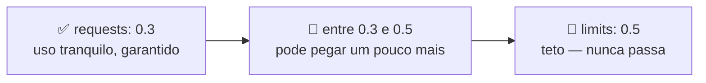
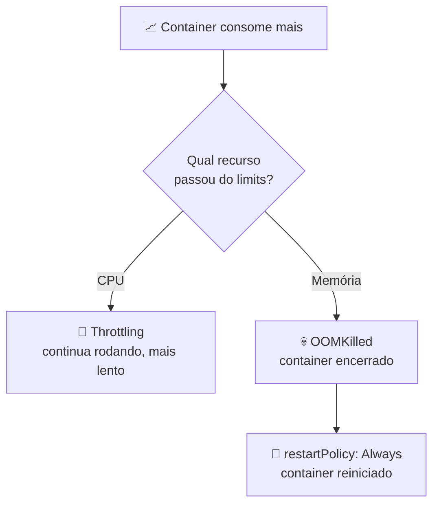

# ⚖️ Limitando CPU e memória dos Pods

> **Resumindo:** todo Pod precisa nascer já sabendo o máximo de CPU e memória que pode consumir. Isso é definido no YAML, em `resources`, com dois campos: `requests` (o que o container pode usar tranquilamente) e `limits` (o teto que nunca é ultrapassado).

## 🎯 Por que limitar

- Limitar CPU e memória dos Pods é imprescindível: é graças a isso que o cluster pode ser gerenciado com mais qualidade, com a certeza da **capacidade** que ele tem.
- Por isso, todo Pod precisa nascer já com o limite máximo de CPU e memória definido.

## 📄 Definindo no YAML: `resources`

Dentro da `spec` do container existe o campo `resources`, com `requests` e `limits`. Exemplo do `pod-limitado.yaml`:

```yaml
apiVersion: v1
kind: Pod
metadata:
  labels:
    run: giropops
  name: giropops
spec:
  containers:
  - image: ubuntu
    name: ubuntu
    args:
      - sleep
      - "1800"
    resources:
      limits:
        cpu: "0.5"
        memory: "256Mi"
      requests:
        cpu: "0.3"
        memory: "64Mi"
  dnsPolicy: ClusterFirst
  restartPolicy: Always
```

| Campo | O que representa | No exemplo |
|---|---|---|
| `requests` | Quantidade **garantida** pro container | `cpu: 0.3` · `memory: 64Mi` |
| `limits` | Capacidade **inegociável** — o teto máximo | `cpu: 0.5` · `memory: 256Mi` |

## 🧮 CPU: `requests` x `limits`

- `requests` garante determinado consumo de CPU. Ex: `0.3` = 30% de um core.
- `limits` é a capacidade inegociável.

Com `0.3` em `requests` e `0.5` em `limits`, o comportamento é: o container pode usar tranquilamente 0.3 CPU; se precisar de mais, pode pegar um pouco a mais, mas nunca passa de 0.5.



## 🧠 Memória RAM

A memória também pode ser limitada, usando unidades como `Mi` (mebibytes). Ex: `memory: 128Mi`.

> ⚠️ **Atenção à unidade:** `Mi` e `MB` não são a mesma coisa.

| Unidade | Nome | Valor em bytes |
|---|---|---|
| `Mi` (MiB) | mebibyte | 1024² = **1.048.576** bytes |
| `MB` | megabyte | **1.000.000** bytes |

## 💥 O que acontece ao ultrapassar o `limits`

O comportamento é diferente pra cada recurso:

| Recurso | Ao chegar no `limits` | O container continua vivo? |
|---|---|---|
| **CPU** | Sofre **throttling**: o uso é limitado e o container fica mais lento | ✅ Sim |
| **Memória** | O Kernel mata o processo por **OOM** (*Out Of Memory*) e o status vira `OOMKilled` | ❌ Não — é reiniciado |

- **CPU não mata o container:** o `limits` de CPU funciona como um freio. O container nunca passa do teto, mas também não morre por causa disso.
- **Memória mata o container:** ao ultrapassar o `limits` de memória, o container é encerrado por OOM. Como o Pod do exemplo tem `restartPolicy: Always`, o container é reiniciado em seguida.
- O motivo do encerramento aparece como `OOMKilled` no `kubectl describe pods giropops`, na seção do container (`Last State`).



## 🗓️ `requests` e o Scheduler

- Além de garantir o recurso ao container, os `requests` são o que o **Kube Scheduler** considera pra decidir em qual Node o Pod cabe: o Pod só é colocado num Node que tenha CPU e memória livres pra atender o que foi pedido em `requests`.
- Sem `requests` declarados, o Scheduler não tem como saber o quanto o Pod precisa, e a capacidade do cluster deixa de ser previsível.

> 🔗 **Conexão:** o Kube Scheduler é o componente do Control Plane que escolhe o Node de cada Pod (ver **Arquitetura do Kubernetes**).

## 🧪 Testando o limite com `stress`

Entrando no Pod criado a partir do `pod-limitado.yaml`:

```bash
kubectl exec -ti giropops -- bash
```

```bash
free -m
```

- O `free -m` mostra a memória total do **Node**, não o limite definido pro Pod.

Pra simular um estresse de memória, instalar o `stress` dentro do Pod:

```bash
apt update
apt install stress
```

E rodar um teste com 64 MB de memória em 1 worker do `stress`:

```bash
stress --vm-bytes 64M --vm 1
```

- Conforme o valor de `--vm-bytes` aumenta, uma hora vai quebrar e o Pod pode morrer: ao ultrapassar o `limits` de memória (`256Mi` no YAML acima), o container é encerrado por OOM, como descrito em **O que acontece ao ultrapassar o `limits`**.

*Resultado do teste ao ultrapassar o limite: ainda não anotado.*

## 🔬 Vendo os processos: `ps -ef`

```bash
ps -ef
```

- Mostra os processos que estão rodando no sistema.

| Parte | Significado |
|---|---|
| `ps` | **p**rocess **s**tatus — status dos processos |
| `-e` | **e**very — todos os processos |
| `-f` | **f**ull — formato completo |

> 🔗 **Conexão:** o **Deployment** também é o lugar onde `requests` e `limits` costumam ficar definidos, junto com a imagem e o número de réplicas (ver **O que é um Pod?**). O `pod-limitado.yaml` aplica a mesma ideia direto num Pod.
