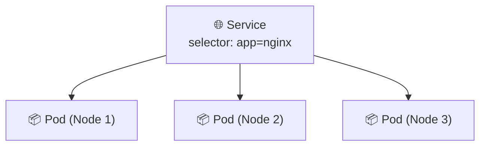
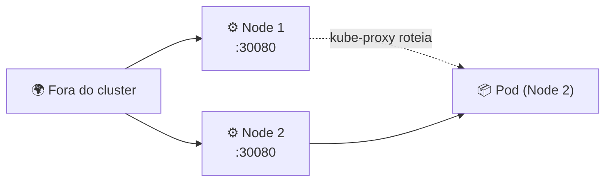

# 🌐 O que é um Service?

> **Resumindo:** um Service é o objeto que dá um endereço estável a um grupo de Pods, e é ele quem expõe esse grupo — pra dentro do cluster (outros Pods) ou pra fora dele (NodePort, LoadBalancer).

## 🎯 Por que o Service existe

- Pods são **efêmeros**: quando um morre, o ReplicaSet sobe outro no lugar (ver **O que é um Pod?**) — mas o novo Pod nasce com um **IP diferente**.
- Sem Service, qualquer coisa apontando pro IP antigo de um Pod quebraria a cada substituição.
- O Service resolve isso dando um **IP e nome DNS estáveis** pro conjunto de Pods, independente de quais estão vivos naquele momento.

## 🏷️ Como o Service escolhe seus Pods

- Usa um **selector** de labels — o mesmo mecanismo que o ReplicaSet usa pra saber quais Pods contar. Todo Pod com aquelas labels entra automaticamente no Service.
- Quem de fato programa o roteamento do tráfego é o **kube-proxy**, rodando em cada Worker (ver **Arquitetura do Kubernetes**) — ele mantém as regras que direcionam o tráfego do Service pros Pods certos.

## 🚪 Tipos de Service

| Tipo | Exposição | Uso típico |
|---|---|---|
| **ClusterIP** (padrão) | Só dentro do cluster | Comunicação Pod → Pod, serviço interno |
| **NodePort** | Porta fixa (30000–32767 TCP) aberta em **todos** os Workers | Acesso externo simples, sem depender de um load balancer de nuvem |
| **LoadBalancer** | Provisiona um Load Balancer externo do provedor cloud, que aponta pro NodePort | Expor o serviço pra internet em ambiente cloud |
| **ExternalName** | Só um CNAME de DNS pra um endereço externo | Apontar pra um serviço que vive fora do cluster |

## 🔌 NodePort em detalhe

- Reserva a **mesma porta** (entre 30000 e 32767) em **todos** os Nodes do cluster — inclusive nos que não têm nenhum Pod daquele Service rodando.
- O tráfego externo pode chegar em **qualquer** Node do cluster; o kube-proxy daquele Node redireciona a requisição pro Pod certo, mesmo que ele esteja rodando em outro Node.

> 🔗 **Conexão:** essa é a mesma faixa de NodePort documentada na tabela de portas em **Arquitetura do Kubernetes** — 30000–32767 TCP, reservada em todo Worker.

> 🔗 **Conexão:** o Service seleciona os mesmos Pods que o ReplicaSet mantém no ar (ver **O que é um Pod?**) — os dois apontam pro mesmo conjunto de Pods, mas com responsabilidades diferentes: um garante **quantidade**, o outro garante **acesso**.

> 👉 **Continua em kubectl na prática: criando e expondo um Pod**: como sair da teoria e criar/expor um Pod de verdade, sem escrever nenhum YAML.
