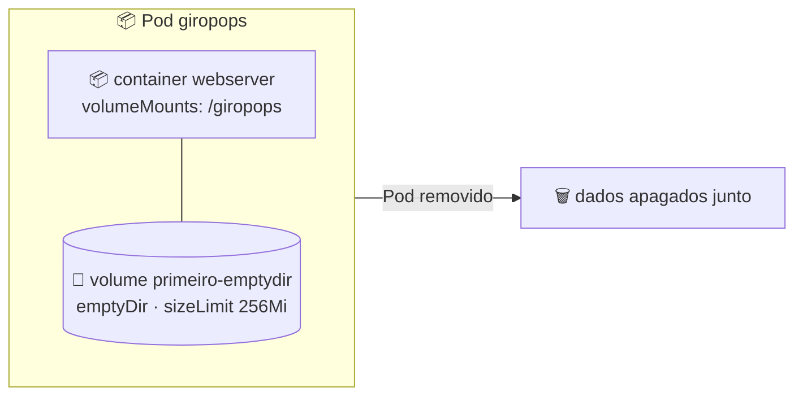

# 💾 Volumes: persistindo dados no Pod (emptyDir)

> **Resumindo:** volume é uma forma de persistir dados num Pod. O `emptyDir` é o tipo mais simples: cria um diretório montado dentro do container, mas os dados duram só enquanto o Pod existir.

## 💾 O que é um volume

- Volume é uma forma de **persistir os dados** de um Pod.
- Pra estudar o assunto, o exemplo usado é o `pod-emptydir.yaml`.

## 📄 Definindo no YAML: `volumeMounts` e `volumes`

O volume é configurado em **duas partes** do manifesto, ligadas pelo nome do volume:

```yaml
apiVersion: v1
kind: Pod
metadata:
  labels:
    run: giropops
  name: giropops
spec:
  containers:
  - image: nginx
    name: webserver
    volumeMounts:
      - mountPath: /giropops
        name: primeiro-emptydir
    resources:
      limits:
        cpu: "1"
        memory: "256Mi"
      requests:
        cpu: "0.5"
        memory: "64Mi"
  dnsPolicy: ClusterFirst
  restartPolicy: Always
  volumes:
    - name: primeiro-emptydir
      emptyDir:
        sizeLimit: 256Mi
```

| Onde | Campo | Função | No exemplo |
|---|---|---|---|
| `spec.containers` | `volumeMounts` | Define **onde** e **qual** volume é montado no container | — |
| `spec.containers` › `volumeMounts` | `mountPath` | Diretório onde o volume será montado | `/giropops` |
| `spec.containers` › `volumeMounts` | `name` | Nome do volume que será montado | `primeiro-emptydir` |
| `spec` (mesmo nível de `containers`) | `volumes` | Grupo que especifica as características do volume | — |
| `spec.volumes` | `emptyDir.sizeLimit` | Tipo do volume e o tamanho limite dele | `256Mi` |



- O `name` do `volumeMounts` (`primeiro-emptydir`) é o mesmo `name` declarado em `volumes`: é assim que o container sabe qual volume montar.
- O `sizeLimit` usa a mesma unidade `Mi` vista em **Limitando CPU e memória**.

## 🔍 Conferindo dentro do Pod

Com o Pod criado a partir do YAML, um `exec` mostra o diretório do ponto de montagem:

```bash
kubectl apply -f pod-emptydir.yaml
kubectl exec -ti giropops -- bash
```

- Dentro do container, a pasta `/giropops` aparece, e é ali que o volume está montado (ver **kubectl na prática** pro `exec`).

## ⚠️ Limitação do `emptyDir`

> ⚠️ **Atenção:** o `emptyDir` não é a melhor opção de persistência. Tudo o que estiver nele é removido junto com o Pod: quando o Pod for apagado, os dados também serão.

- Ele serve pra criar o Pod já com o ponto de montagem desejado.

> 🔗 **Conexão:** volumes montados no Pod são compartilhados entre os containers dele, junto com o IP (ver **O que é um Pod?**). O bloco `resources` do exemplo é o mesmo visto em **Limitando CPU e memória**.
